# Polyglot Codebase Knowledge Graph

> Generated offline by **readmenator**. Supports C, C++, Python, Go, Rust, JS/TS, Java, C#, Shell, PHP, Dart, GDScript, Nim, ASM, Ruby, Swift, Kotlin, Scala, Lua, Elixir.
> No LLMs. No tokens. Pure static analysis. See more [here](https://github.com/grisuno/ReadMenator)

**Total Files Parsed:** 3 | **Total Symbols Extracted:** 32 | **Total Imports:** 19

<!-- ranking_model: v1.0 | weights: {ppr:0.45,auth:0.2,test:0.15,doc:0.1,fresh:0.1} | alpha:0.85 | commit:f0ae16d | date:2026-07-18 -->


## Table of Contents

1. [Statistics Dashboard](#statistics-dashboard)
2. [Architectural Layers](#architectural-layers)
3. [Ranked Context](#ranked-context)
4. [God Nodes](#god-nodes)
5. [Suggested Questions](#suggested-questions)
6. [Taint Propagation Map](#taint-propagation-map)
7. [Hotspot Analysis](#hotspot-analysis)
8. [Change Impact Analysis](#change-impact-analysis)
9. [Suggested Linting Rules](#suggested-linting-rules)
10. [Orphans](#orphans)
11. [Query Recipes](#query-recipes)
12. [Structural Knowledge Map](#structural-knowledge-map)
13. [UML Class Diagram](#uml-class-diagram)
14. [Code Property Graph](#code-property-graph)
15. [Architecture Reference](#architecture-reference)
    - [GO (1 files)](#go-1-files)
    - [PY (2 files)](#py-2-files)

---

## Statistics Dashboard

| Metric | Value |
|--------|-------|
| Total Files | 3 |
| Total Symbols | 32 |
| Total Imports | 19 |
| Call Edges | 64 |
| Inheritance Edges | 0 |
| Languages | 2 |
| Avg Symbols/File | 10.7 |
| Avg Imports/File | 6.3 |

### Top Files by Import Count (Fan-Out)

| File | Imports | Symbols | Language |
|------|---------|---------|----------|
| `main.go` | 13 | 19 | go |
| `ip_to_db.py` | 5 | 8 | py |
| `app.py` | 1 | 5 | py |

---

## Architectural Layers

Auto-detected from path patterns, naming conventions, and imported frameworks.

| Layer | Files |
|-------|-------|
| utility | 3 |

### utility

- `app.py` (py, 5 symbols)
- `ip_to_db.py` (py, 8 symbols)
- `main.go` (go, 19 symbols)

---

## Ranked Context

Files ranked by composite score for the current query context. The ranking combines Personalized PageRank (query relevance), global authority, test coverage, documentation coverage, and code freshness. Model: v1.0.

| Rank | File | Composite | PPR | Authority | Test | Doc |
|------|------|-----------|-----|-----------|------|-----|
| 1 | `main.go` | 0.0947 | 0.0000 | 0.0000 | 0.00 | 0.95 |
| 2 | `app.py` | 0.0000 | 0.0000 | 0.0000 | 0.00 | 0.00 |
| 3 | `ip_to_db.py` | 0.0000 | 0.0000 | 0.0000 | 0.00 | 0.00 |

---

## God Nodes

Most architecturally central files ranked by combined import/export degree and symbol richness.

| File | Score | Connections | PageRank |
|------|-------|-------------|----------|
| `main.go` | 1.9 | | 0.0000 |
| `ip_to_db.py` | 0.8 | | 0.0000 |
| `app.py` | 0.5 | | 0.0000 |

---

## Suggested Questions

Auto-generated exploration prompts based on graph structure:

- What does main.go depend on, and what depends on it? (0 connections)
- What does ip_to_db.py depend on, and what depends on it? (0 connections)
- What does app.py depend on, and what depends on it? (0 connections)
- What is the overall architecture of this codebase?

---

## Taint Propagation Map

Taint analysis traces how dangerous imports propagate through the codebase via transitive dependencies. Source files import dangerous modules directly; sink files receive the danger indirectly.

**Taint Sources:** 2 | **Taint Sinks:** 2 | **Propagation Paths:** 2

- `ip_to_db.py` imports `requests` (0 hop to `ip_to_db.py`) [medium]
  Path: ip_to_db.py
- `main.go` imports `exec` (0 hop to `main.go`) [critical]
  Path: main.go

---

## Hotspot Analysis

Files ranked by combined complexity (symbol count) and centrality (connection count). High-scoring files are architecturally critical and may need refactoring attention.

| File | Complexity | Centrality | Combined | Symbols | Connections |
|------|-----------|------------|----------|---------|-------------|
| `main.go` | 1.000 | 1.000 | 1.000 | 19 | 13 |
| `app.py` | 0.263 | 0.077 | 0.151 | 5 | 1 |
| `ip_to_db.py` | 0.421 | 0.385 | 0.399 | 8 | 5 |

---

## Change Impact Analysis

Files sorted by how many other files would be affected if they changed. High-impact files should be changed with caution.

| File | Direct Dependents | Transitive Dependents | Total Impact |
|------|------------------|----------------------|--------------|
| `app.py` | 0 | 0 | 0 |
| `ip_to_db.py` | 0 | 0 | 0 |
| `main.go` | 0 | 0 | 0 |

---

## Suggested Linting Rules

Automatically suggested linting and security rules based on patterns detected in the codebase. These can be exported as Semgrep rules using the `--export-rules` flag.

| Rule ID | Severity | Description | Language | Matches |
|---------|----------|-------------|----------|---------|
| `RM001` | info | Large number of functions in py: 13 total | py | 13 |
| `RM002` | info | Large number of functions in go: 19 total | go | 19 |
| `RM003` | info | Print statement found (consider logging instead) | python | 10 |

---

## Orphans

Files with no documentation or low connectivity. These are candidates for documentation investment or cleanup.

- `app.py` (5 symbols, no doc)
- `ip_to_db.py` (8 symbols, no doc)

---

## Query Recipes

Example queries you can run against this knowledge base using the ranking engine:

```
# Find files most relevant to a concept
readmenator query "Where is the import resolver implemented?"

# Rank files by relevance to a topic
readmenator query "How does documentation generation work?"

# Explain why a file ranks highly
readmenator query "explain readmenator/_documentation.py"

# Trace dependency paths with ranked context
readmenator query "path from CLI to exporter"
```

The ranking model uses the following signals:

- **Personalized PageRank** (45% weight): query-specific relevance via seed propagation
- **Global Authority** (20% weight): structural importance via standard PageRank
- **Test Coverage** (15% weight): fraction of symbols referenced in test files
- **Doc Coverage** (10% weight): presence of docstrings and file-level docs
- **Freshness** (10% weight): recent modification activity

Results include score decomposition and justification paths for each ranked item.

---

## Structural Knowledge Map

```mermaid
graph TD
    classDef mod fill:#1e1e1e,stroke:#ff6666,stroke-width:2px,color:#fff;
    classDef cls fill:#2d2d2d,stroke:#4ec9b0,stroke-width:2px,color:#fff;
    classDef fn fill:#333,stroke:#dcdcaa,stroke-width:1px,color:#dcdcaa;
    classDef ext fill:#111,stroke:#666,stroke-dasharray:5 5,color:#aaa;
    main_go["main.go (go)"]
    class main_go mod;
    main_go_initDB["initDB"]
    class main_go_initDB fn;
    main_go --> main_go_initDB
    main_go_getLastCheckpoint["getLastCheckpoint"]
    class main_go_getLastCheckpoint fn;
    main_go --> main_go_getLastCheckpoint
    main_go_setCheckpoint["setCheckpoint"]
    class main_go_setCheckpoint fn;
    main_go --> main_go_setCheckpoint
    main_go_wasIPProcessed["wasIPProcessed"]
    class main_go_wasIPProcessed fn;
    main_go --> main_go_wasIPProcessed
    main_go_ipToInt["ipToInt"]
    class main_go_ipToInt fn;
    main_go --> main_go_ipToInt
    ip_to_db_py["ip_to_db.py (py)"]
    class ip_to_db_py mod;
    app_py["app.py (py)"]
    class app_py mod;
    ext_concurrent_futures["concurrent.futures"]
    class ext_concurrent_futures ext;
    app_py -.->|imports| ext_concurrent_futures
    ip_to_db_py -.->|imports| ext_concurrent_futures
    ext_requests["requests"]
    class ext_requests ext;
    ip_to_db_py -.->|imports| ext_requests
    ext_bs4["bs4"]
    class ext_bs4 ext;
    ip_to_db_py -.->|imports| ext_bs4
    ext_socket["socket"]
    class ext_socket ext;
    ip_to_db_py -.->|imports| ext_socket
    ext_sqlite3["sqlite3"]
    class ext_sqlite3 ext;
    ip_to_db_py -.->|imports| ext_sqlite3
    ext_database_sql["sql"]
    class ext_database_sql ext;
    main_go -.->|imports| ext_database_sql
    ext_flag["flag"]
    class ext_flag ext;
    main_go -.->|imports| ext_flag
    ext_fmt["fmt"]
    class ext_fmt ext;
    main_go -.->|imports| ext_fmt
    ext_log["log"]
    class ext_log ext;
    main_go -.->|imports| ext_log
    ext_net["net"]
    class ext_net ext;
    main_go -.->|imports| ext_net
    ext_net_http["http"]
    class ext_net_http ext;
    main_go -.->|imports| ext_net_http
    ext_os_exec["exec"]
    class ext_os_exec ext;
    main_go -.->|imports| ext_os_exec
    ext_regexp["regexp"]
    class ext_regexp ext;
    main_go -.->|imports| ext_regexp
    ext_strings["strings"]
    class ext_strings ext;
    main_go -.->|imports| ext_strings
    ext_sync["sync"]
    class ext_sync ext;
    main_go -.->|imports| ext_sync
    ext_time["time"]
    class ext_time ext;
    main_go -.->|imports| ext_time
    ext_github_com_mattn_go_sqlite3["go-sqlite3"]
    class ext_github_com_mattn_go_sqlite3 ext;
    main_go -.->|imports| ext_github_com_mattn_go_sqlite3
    ext_golang_org_x_net_html["html"]
    class ext_golang_org_x_net_html ext;
    main_go -.->|imports| ext_golang_org_x_net_html
```



---

## Code Property Graph

Machine-readable Code Property Graph (CPG) in JSON-LD format. This block allows AI agents to parse the full structural graph without additional file reads. Compatible with GraphRAG pipelines.

```json
{"@context": "https://schema.org", "analysis": {"communities": [], "god_nodes": [{"node_id": "main.go", "score": 1.9}, {"node_id": "ip_to_db.py", "score": 0.8}, {"node_id": "app.py", "score": 0.5}], "surprising_connections": []}, "edges": [{"confidence": "EXTRACTED", "relation": "imports", "source": "app.py", "target": "concurrent.futures"}, {"confidence": "EXTRACTED", "relation": "imports", "source": "ip_to_db.py", "target": "concurrent.futures"}, {"confidence": "EXTRACTED", "relation": "imports", "source": "ip_to_db.py", "target": "requests"}, {"confidence": "EXTRACTED", "relation": "imports", "source": "ip_to_db.py", "target": "bs4"}, {"confidence": "EXTRACTED", "relation": "imports", "source": "ip_to_db.py", "target": "socket"}, {"confidence": "EXTRACTED", "relation": "imports", "source": "ip_to_db.py", "target": "sqlite3"}, {"confidence": "EXTRACTED", "relation": "imports", "source": "main.go", "target": "database/sql"}, {"confidence": "EXTRACTED", "relation": "imports", "source": "main.go", "target": "flag"}, {"confidence": "EXTRACTED", "relation": "imports", "source": "main.go", "target": "fmt"}, {"confidence": "EXTRACTED", "relation": "imports", "source": "main.go", "target": "log"}, {"confidence": "EXTRACTED", "relation": "imports", "source": "main.go", "target": "net"}, {"confidence": "EXTRACTED", "relation": "imports", "source": "main.go", "target": "net/http"}, {"confidence": "EXTRACTED", "relation": "imports", "source": "main.go", "target": "os/exec"}, {"confidence": "EXTRACTED", "relation": "imports", "source": "main.go", "target": "regexp"}, {"confidence": "EXTRACTED", "relation": "imports", "source": "main.go", "target": "strings"}, {"confidence": "EXTRACTED", "relation": "imports", "source": "main.go", "target": "sync"}, {"confidence": "EXTRACTED", "relation": "imports", "source": "main.go", "target": "time"}, {"confidence": "EXTRACTED", "relation": "imports", "source": "main.go", "target": "github.com/mattn/go-sqlite3"}, {"confidence": "EXTRACTED", "relation": "imports", "source": "main.go", "target": "golang.org/x/net/html"}], "generator": "readmenator", "metadata": {"edge_count": 83, "file_count": 3, "language_count": 2, "symbol_count": 32}, "nodes": [{"id": "app.py", "kind": "module", "label": "app.py", "language": "py", "sha256": "a96ab996e957f091", "symbol_count": 5, "symbols": [{"kind": "function", "line": 3, "name": "is_private_ip", "signature": "def is_private_ip(ip_int)"}, {"kind": "function", "line": 16, "name": "ip_to_int", "signature": "def ip_to_int(ip)"}, {"kind": "function", "line": 20, "name": "generate_ips", "signature": "def generate_ips(start_ip, end_ip)"}, {"kind": "function", "line": 33, "name": "int_to_ip", "signature": "def int_to_ip(ip_int)"}, {"kind": "function", "line": 36, "name": "main", "signature": "def main()"}]}, {"id": "ip_to_db.py", "kind": "module", "label": "ip_to_db.py", "language": "py", "sha256": "7fbecda90023600f", "symbol_count": 8, "symbols": [{"kind": "function", "line": 8, "name": "is_private_ip", "signature": "def is_private_ip(ip_int)"}, {"kind": "function", "line": 20, "name": "ip_to_domain", "signature": "def ip_to_domain(ip_address)"}, {"kind": "function", "line": 28, "name": "process_page", "signature": "def process_page(domain)"}, {"kind": "function", "line": 43, "name": "ip_to_int", "signature": "def ip_to_int(ip)"}, {"kind": "function", "line": 48, "name": "generate_ips", "signature": "def generate_ips(start_ip, end_ip)"}, {"kind": "function", "line": 66, "name": "int_to_ip", "signature": "def int_to_ip(ip_int)"}, {"kind": "function", "line": 70, "name": "save_to_db", "signature": "def save_to_db(domain, title)"}, {"kind": "function", "line": 79, "name": "main", "signature": "def main()"}]}, {"id": "main.go", "kind": "module", "label": "main.go", "language": "go", "sha256": "782c00e1744ae81a", "symbol_count": 19, "symbols": [{"doc": "initDB inicializa la base de datos", "kind": "function", "line": 35, "name": "initDB", "signature": "func initDB("}, {"doc": "getLastCheckpoint devuelve la última IP escaneada por el algoritmo", "kind": "function", "line": 65, "name": "getLastCheckpoint", "signature": "func getLastCheckpoint("}, {"doc": "setCheckpoint guarda la última IP procesada", "kind": "function", "line": 75, "name": "setCheckpoint", "signature": "func setCheckpoint("}, {"doc": "wasIPProcessed verifica si una IP ya fue procesada como PTR", "kind": "function", "line": 85, "name": "wasIPProcessed", "signature": "func wasIPProcessed("}, {"doc": "ipToInt convierte IP string a uint32", "kind": "function", "line": 92, "name": "ipToInt", "signature": "func ipToInt("}, {"doc": "intToIP convierte uint32 a string IP", "kind": "function", "line": 104, "name": "intToIP", "signature": "func intToIP("}, {"doc": "isPrivateIP verifica si una IP es privada", "kind": "function", "line": 114, "name": "isPrivateIP", "signature": "func isPrivateIP("}, {"doc": "reverseDNS realiza lookup inverso", "kind": "function", "line": 123, "name": "reverseDNS", "signature": "func reverseDNS("}, {"doc": "extractTitle extrae el <title> de HTML", "kind": "function", "line": 132, "name": "extractTitle", "signature": "func extractTitle("}, {"doc": "fetchTitle intenta HTTP y luego HTTPS", "kind": "function", "line": 151, "name": "fetchTitle", "signature": "func fetchTitle("}, {"doc": "resolveDomainToIP resuelve un dominio a IP pública", "kind": "function", "line": 178, "name": "resolveDomainToIP", "signature": "func resolveDomainToIP("}, {"doc": "getRootDomain extrae el dominio raíz (ej: google.com de mail.google.com)", "kind": "function", "line": 195, "name": "getRootDomain", "signature": "func getRootDomain("}, {"doc": "runCrtSh busca subdominios usando crt.sh", "kind": "function", "line": 222, "name": "runCrtSh", "signature": "func runCrtSh("}, {"doc": "contains verifica si un slice tiene un string", "kind": "function", "line": 252, "name": "contains", "signature": "func contains("}, {"doc": "union combina dos slices sin duplicados", "kind": "function", "line": 262, "name": "union", "signature": "func union("}, {"doc": "saveToDB guarda un registro con source", "kind": "function", "line": 281, "name": "saveToDB", "signature": "func saveToDB("}, {"doc": "processPTRIP procesa una IP: PTR → dominio → web → crt.sh → subdominios", "kind": "function", "line": 294, "name": "processPTRIP", "signature": "func processPTRIP("}, {"doc": "scanIPsWithPTR escanea desde la última IP guardada + 1", "kind": "function", "line": 361, "name": "scanIPsWithPTR", "signature": "func scanIPsWithPTR("}, {"kind": "function", "line": 422, "name": "main", "signature": "func main("}]}], "type": "CodePropertyGraph", "version": "1.0"}
```

---

## Architecture Reference

### GO (1 files)

#### `main.go`
**Path:** `main.go`

**Functions:**
- `initDB` (line 35) `func initDB(` - *initDB inicializa la base de datos*
- `getLastCheckpoint` (line 65) `func getLastCheckpoint(` - *getLastCheckpoint devuelve la última IP escaneada por el algoritmo*
- `setCheckpoint` (line 75) `func setCheckpoint(` - *setCheckpoint guarda la última IP procesada*
- `wasIPProcessed` (line 85) `func wasIPProcessed(` - *wasIPProcessed verifica si una IP ya fue procesada como PTR*
- `ipToInt` (line 92) `func ipToInt(` - *ipToInt convierte IP string a uint32*
- `intToIP` (line 104) `func intToIP(` - *intToIP convierte uint32 a string IP*
- `isPrivateIP` (line 114) `func isPrivateIP(` - *isPrivateIP verifica si una IP es privada*
- `reverseDNS` (line 123) `func reverseDNS(` - *reverseDNS realiza lookup inverso*
- `extractTitle` (line 132) `func extractTitle(` - *extractTitle extrae el <title> de HTML*
- `fetchTitle` (line 151) `func fetchTitle(` - *fetchTitle intenta HTTP y luego HTTPS*
- `resolveDomainToIP` (line 178) `func resolveDomainToIP(` - *resolveDomainToIP resuelve un dominio a IP pública*
- `getRootDomain` (line 195) `func getRootDomain(` - *getRootDomain extrae el dominio raíz (ej: google.com de mail.google.com)*
- `runCrtSh` (line 222) `func runCrtSh(` - *runCrtSh busca subdominios usando crt.sh*
- `contains` (line 252) `func contains(` - *contains verifica si un slice tiene un string*
- `union` (line 262) `func union(` - *union combina dos slices sin duplicados*
- `saveToDB` (line 281) `func saveToDB(` - *saveToDB guarda un registro con source*
- `processPTRIP` (line 294) `func processPTRIP(` - *processPTRIP procesa una IP: PTR → dominio → web → crt.sh → subdominios*
- `scanIPsWithPTR` (line 361) `func scanIPsWithPTR(` - *scanIPsWithPTR escanea desde la última IP guardada + 1*
- `main` (line 422) `func main(`

### PY (2 files)

#### `app.py`
**Path:** `app.py`

**Functions:**
- `is_private_ip` (line 3) `def is_private_ip(ip_int)`
- `ip_to_int` (line 16) `def ip_to_int(ip)`
- `generate_ips` (line 20) `def generate_ips(start_ip, end_ip)`
- `int_to_ip` (line 33) `def int_to_ip(ip_int)`
- `main` (line 36) `def main()`

#### `ip_to_db.py`
**Path:** `ip_to_db.py`

**Functions:**
- `is_private_ip` (line 8) `def is_private_ip(ip_int)`
- `ip_to_domain` (line 20) `def ip_to_domain(ip_address)`
- `process_page` (line 28) `def process_page(domain)`
- `ip_to_int` (line 43) `def ip_to_int(ip)`
- `generate_ips` (line 48) `def generate_ips(start_ip, end_ip)`
- `int_to_ip` (line 66) `def int_to_ip(ip_int)`
- `save_to_db` (line 70) `def save_to_db(domain, title)`
- `main` (line 79) `def main()`
